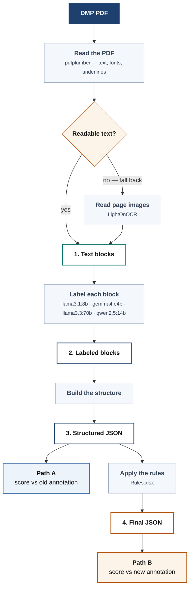

# DMPBridge

[](https://github.com/fairdataihub/dmpbridge/graphs/contributors)
[](https://github.com/fairdataihub/dmpbridge/stargazers)
[](https://github.com/fairdataihub/dmpbridge/issues)
[](LICENSE)
[](#how-to-cite)

A Data Management Plan (DMP) describes how researchers will manage, preserve, and share
project data in line with the Findable, Accessible, Interoperable, and Reusable (FAIR)
principles and other relevant disciplinary guidelines. DMPs are commonly required by funders
with every grant proposal, but the formats and requirements imposed by each funder keep
evolving, and no two funders' PDFs are structured the same way.

DMPBridge is an open-source (MIT License), Python-based pipeline that converts DMP PDFs from
any funder format into DMP Tool JSON, combining a narrative portion that mirrors DMP Tool's
internal structure with the RDA DMP Common Standard JSON for machine-actionable output.

This project is part of a broader extension of the DMP Tool platform. The ultimate goal is to integrate the DMP Chef pipeline into the [DMP Tool](https://dmptool.org/), providing researchers with a familiar and convenient user interface that does not require any coding knowledge.

👉 Learn more: **[DMP Bridge](https://fairdataihub.org/dmp-bridge)**.
> **This is an active research project, things change often.**

---

## How it works



Each numbered box is written to disk, so any stage can be inspected on its own. Every block
gets one of five labels:

| Label | Meaning |
|---|---|
| `title` | Document title |
| `section.title` | Section heading |
| `section.description` | Instructions written by the funder |
| `question.text` | A question or prompt |
| `answer.text` | The researcher's response |


---

## Step 1 — Install DMPBridge

**Requirements:** Python 3.10+ and [Ollama](https://ollama.com). No GPU needed for the
default setup.

```bash
git clone https://github.com/fairdataihub/dmpbridge.git
cd dmpbridge

python -m venv venv
venv\Scripts\Activate.ps1        # Windows
# source venv/bin/activate       # macOS / Linux

pip install -e .
```

Optional extras, only if you need them: `pip install -e ".[notebooks]"` for the analysis
notebooks, `".[docling]"` or `".[lighton]"` for the alternative extractors, `".[dev]"` for
the tests.

---

## Step 2 — Pull a model

Install [Ollama](https://ollama.com), then pull a model. `gemma4:e4b` is the recommended
starting point — about 3 GB and the strongest of the small models on this project's
documents:

```bash
ollama pull gemma4:e4b
```

Any model already in Ollama works — `llama3.1:8b`, `gemma4:e4b`  and `llama3.3:70b` are
also evaluated here. Larger models are slower: `llama3.3:70b` takes roughly 112 seconds per
document against about 8 seconds for the small ones.

---

## Step 3 — Start Ollama

```bash
ollama serve
```

Leave it running. DMPBridge talks to it at `http://localhost:11434` by default — change
that with `--host` if yours differs.

**On a multi-GPU machine, or if `gemma4:e4b` crashes on load, Ollama needs extra
environment variables** — see [docs/troubleshooting.md](docs/troubleshooting.md).

---

## Step 4 — Run DMPBridge

Two ways in. Option A is the gentler one if you want to see a single document go through;
Option B is what the research runs use.

### Option A — Jupyter demo

Edit [`demo/config.yaml`](demo/config.yaml) — model, extractor, fallback, sample range —
then open [`notebooks/demo-from-yaml-config.ipynb`](notebooks/demo-from-yaml-config.ipynb)
and run it top to bottom. It shows the YAML as input and the final labeled document as
output, side by side. Nothing inside the notebook needs editing; the config is the only
input.

It runs the same two-step read the CLI does. **A normal PDF is read by pdfplumber**, which
takes the text layer along with the bold, italic and underline cues the fonts carry. **A PDF
whose text layer is missing or broken** — a scanned page, or fonts with no
character-to-text mapping — fails a readability check before the model ever sees it, and is
re-read from its page images by **LightOnOCR** instead. That check runs per document, so
clean PDFs never touch the fallback, and you'll see `[fallback]` lines in the output saying
why one did. Set `fallback: null` to turn the rescue off.

The same config also runs headless, writing each stage into
`demo/output/{labeled,structured,final}/`:

```bash
python scripts/run_demo.py
```

### Option B — CLI

`dmpbridge-wholedoc` is the command-line entry point that runs the pipeline end to end —
extract, label, structure, apply rules:

```bash
# one document
dmpbridge-wholedoc --model gemma4:e4b --extractor pdfplumber --fallback auto --start 1 --end 1

# the whole sample set
dmpbridge-wholedoc --model gemma4:e4b --extractor pdfplumber --fallback auto --start 1 --end 13
```

The final JSON lands in `data/output/4_final/<model>_<extractor>_whole_doc/`.

To use DMPBridge as a library instead of a command:

```python
import dmpbridge

blocks = dmpbridge.process_pdf(
    "document.pdf",
    model="gemma4:e4b",
    extractor="pdfplumber",
    fallback="auto",
    structured_output="structured.json",
)
```

---

## Inputs and configuration

### Inputs

| What | Where | Notes |
|---|---|---|
| DMP PDFs | `data/input/pdfs/` | named `sample1.pdf`, `sample2.pdf`, … — the `--start`/`--end` range indexes these |
| Annotation rules | `data/input/Rules.xlsx` | drives stage 4; **column order is load-bearing**, see [docs/scoring.md](docs/scoring.md) |
| Reference annotations | `data/input/ground_truth_old_version/`, `ground_truth_new_version/` | only needed for scoring |

### Execution settings — `demo/config.yaml`

One YAML file describes a run. This is what both Option A entry points read:

```yaml
name: Demo run
strategy: wholedoc
provider: ollama
host: http://localhost:11434

model: llama3.1:8b          # any model already pulled in Ollama

extractor: pdfplumber       # pdfplumber | lightonocr | docling
fallback: auto              # auto = LightOnOCR | docling | null to disable

pdf_dir: data/input/pdfs    # expects sample1.pdf, sample2.pdf, ...
sample_start: 1
sample_end: 1               # keep this small for a quick demo run
```

`extractor` is what reads a normal PDF; `fallback` is what rescues one whose text layer is
broken. They are separate settings because the rescue is conditional — the fallback only
runs on a document that fails the readability check.

`experiments/full-example.yaml` shows every field the format accepts, including multiple
models, multiple extractors, and the `evaluation:` list that drives scoring.

### Execution settings — CLI flags

The same settings on the command line, for Option B:

| Flag | Default | What it does |
|---|---|---|
| `--model` | from config | any model pulled in Ollama |
| `--extractor` | `pdfplumber` | `pdfplumber`, `lightonocr` or `docling` |
| `--start` / `--end` | `1` / `10` | inclusive sample range |
| `--pdf-dir` | `data/input/pdfs` | where the PDFs live |
| `--host` | `http://localhost:11434` | Ollama server URL |
| `--fallback` | off | `auto` re-reads a document with LightOnOCR when its text extracts as garbage |
| `--no-cache` | off | re-extract even when stage 1 already has the document |
| `--no-rules` | off | stop after stage 3, skip the rule-converted final JSON |
| `--no-save-native` | off | skip the extractor's raw native dump |
| `--force-ocr` | off | docling only — OCR every page instead of trusting the text layer |

---

## Outputs

```
data/output/
├── 1_extracted/<extractor>/sampleN.json     text blocks, no labels
├── 2_labeled/<tag>/sampleN.json             the same blocks, labeled
├── 3_structured/<tag>/sampleN.json          nested into the DMP Tool schema
└── 4_final/<tag>/sampleN.json               annotation rules applied
```

`<tag>` is `<model>_<extractor>_whole_doc`. Filenames are the same at every stage, so you
can open `sampleN.json` in each folder and follow one document through.

**Stage 1 is keyed by extractor, not by model**, and is cached — reading a PDF doesn't
depend on which LLM labels it, so labeling with four models costs one read, not four.
Stages 2–4 are cached by file existence too: **a document that already has output is
skipped**. To run it again, delete its files under `data/output/`.

---

## Documentation

| Page | Covers |
|---|---|
| [docs/pipeline.md](docs/pipeline.md) | the four stages in detail |
| [docs/extraction.md](docs/extraction.md) | the three extractors, the visual-emphasis markers, native dumps, and scanned or broken PDFs |
| [docs/scoring.md](docs/scoring.md) | Path A / Path B, the match threshold, the results notebooks, and how to read the numbers |
| [docs/troubleshooting.md](docs/troubleshooting.md) | Ollama on multiple GPUs, the `gemma4:e4b` load crash, CUDA torch for LightOnOCR |

Tests:

```bash
pip install -e ".[dev]"
pytest tests/
```

---

## License

MIT — see [LICENSE](LICENSE). You may use, modify and redistribute this code, including
commercially, provided the copyright notice is kept.

---

## Feedback and contributions

Bug reports, questions and suggestions are welcome as
[GitHub issues](https://github.com/fairdataihub/dmpbridge/issues). When reporting a problem
with a document, the most useful things to include are the command you ran, the model and
extractor, and the stage-1 JSON — that usually separates an extraction problem from a model
one.

Pull requests are welcome too. Please run `pytest tests/` before opening one. Two things
worth knowing before you edit:

- **The system prompt in `dmpbridge/prompts/constants.py` is whitespace-significant.**
  Moving blank lines, with no
  wording change, has moved F1 by nearly two points. Don't reformat it, and re-run every
  model after any prompt change — prompt edits do not transfer between models.
- **The column order in `data/input/Rules.xlsx` is load-bearing.** A test reads the sheet
  header and fails if it changes; if that test fails, fix `RULE_FIELDS` rather than the
  test.

---

## How to cite

If you use DMPBridge in published work, please cite it. GitHub builds a formatted citation
from [CITATION.cff](CITATION.cff) — use the **Cite this repository** button on the
repository page, or:

```bibtex
@software{zeinali_dmpbridge,
  author  = {Zeinali, Nahid},
  title   = {DMPBridge: structured extraction of Data Management Plans with local LLMs},
  year    = {2026},
  url     = {https://github.com/fairdataihub/dmpbridge},
  version = {0.1.0}
}
```
