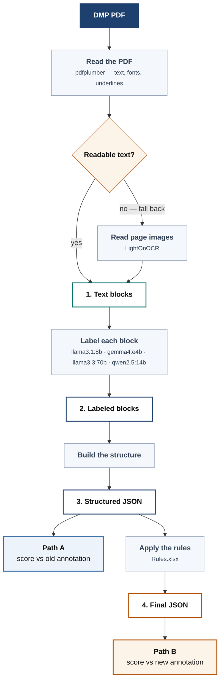

# DMPBridge

[](https://github.com/fairdataihub/dmpbridge/graphs/contributors)
[](https://github.com/fairdataihub/dmpbridge/stargazers)
[](https://github.com/fairdataihub/dmpbridge/issues)
[](LICENSE)
[](#how-to-cite)

**Turn a Data Management Plan PDF into structured JSON — on your own machine, with a local
model. Nothing is uploaded anywhere.**

A Data Management Plan (DMP) describes how researchers will manage, preserve, and share
project data in line with the Findable, Accessible, Interoperable, and Reusable (FAIR)
principles and other relevant disciplinary guidelines. DMPs are commonly required by funders
with every grant proposal, but the formats and requirements imposed by each funder keep
evolving, and no two funders' PDFs are structured the same way.

DMPBridge is an open-source (MIT License), Python-based pipeline that converts DMP PDFs from
any funder format into DMP Tool JSON, combining a narrative portion that mirrors DMP Tool's
internal structure with the RDA DMP Common Standard JSON for machine-actionable output.

This project is part of a broader extension of the DMP Tool platform. The ultimate goal is
to integrate the DMP Chef pipeline into the [DMP Tool](https://dmptool.org/), providing
researchers with a familiar and convenient user interface that does not require any coding
knowledge.

👉 Learn more: **[DMP Bridge](https://fairdataihub.org/dmp-bridge)**

> **This is an active research project, things change often.**

---

## Quick start

Three commands' worth of setup, then one command to run it. You need
[Python 3.10+](https://www.python.org/downloads/) and [Ollama](https://ollama.com). No GPU
required.

```bash
# 1 — get the code and install it
git clone https://github.com/fairdataihub/dmpbridge.git
cd dmpbridge
python -m venv venv
venv\Scripts\Activate.ps1          # macOS / Linux:  source venv/bin/activate
pip install -e .

# 2 — download a local model (~3 GB, one time)
ollama pull gemma4:e4b

# 3 — label your first document
dmpbridge-wholedoc --model gemma4:e4b --fallback auto --start 1 --end 1
```

That takes about 20 seconds and writes your result to:

```
data/output/4_final/gemma4-e4b_pdfplumber_whole_doc/sample1.json
```

Change `--end 1` to `--end 13` to run the whole sample set. A document that needs the OCR
rescue below takes longer — around 40 seconds.

> **`Error: could not connect to ollama`?** Ollama isn't running. Open a second terminal
> and leave `ollama serve` going in it, then re-run step 3.

### What you get

The PDF goes in as flat text. What comes out is nested — sections, the questions inside
them, and the researcher's answer attached to each question:

```json
{
  "title": "DATA MANAGEMENT AND SHARING PLAN",
  "section": [
    {
      "title": "Element 1: Data Type:",
      "order": 1,
      "question": [
        {
          "text": "A. Types and amount of scientific data expected to be generated…",
          "answer": {
            "json": {
              "type": "textArea",
              "answer": "This secondary data analysis project will analyze deidentified…"
            }
          }
        }
      ]
    }
  ]
}
```

---

## Run it on your own PDF

The command above works through the bundled sample set. For a document of your own, point
`dmpbridge` straight at the file:

```bash
dmpbridge my-plan.pdf --model gemma4:e4b
```

It writes `my-plan_labeled.json` and `my-plan_labeled_structured.json` next to your PDF.

**Scanned or image-only PDFs are handled for you.** DMPBridge checks whether the text it
pulled out is actually readable before sending it to the model. If a PDF has no real text
layer — a scan, or fonts with no character mapping — it is re-read from the page images by
LightOnOCR instead, and you'll see a `[fallback]` line saying so. This runs per document,
and normal PDFs are untouched. (The rescue needs a CUDA GPU; without one it warns and
carries on.)

---

## Prefer a notebook?

[`notebooks/demo-from-yaml-config.ipynb`](notebooks/demo-from-yaml-config.ipynb) runs the
same pipeline and shows the settings and the finished document side by side. Edit
[`demo/config.yaml`](demo/config.yaml) — model, extractor, sample range — then run the
notebook top to bottom. Nothing inside the notebook needs changing.

The same config runs without Jupyter, writing each stage into `demo/output/`:

```bash
python scripts/run_demo.py
```

---

## How it works



The model's one job is to decide what each piece of text *is*. Every block gets one of five
labels, and the structure is built from those:

| Label | Meaning |
|---|---|
| `title` | Document title |
| `section.title` | Section heading |
| `section.description` | Instructions written by the funder |
| `question.text` | A question or prompt |
| `answer.text` | The researcher's response |

Each numbered box is written to disk, so you can open any stage and see exactly what
happened:

```
data/output/
├── 1_extracted/<extractor>/sampleN.json     text blocks, no labels
├── 2_labeled/<tag>/sampleN.json             the same blocks, labeled
├── 3_structured/<tag>/sampleN.json          nested into the DMP Tool schema
└── 4_final/<tag>/sampleN.json               annotation rules applied
```

`<tag>` is `<model>_<extractor>_whole_doc`. Filenames are the same at every stage, so you
can follow one document all the way through.

**Re-running skips finished work.** A document that already has output is left alone, and
reading a PDF is cached separately from labeling it — so trying a second model costs one
model run, not a second read. To redo a document, delete its files under `data/output/`.

---

## Documentation

| Page | Covers |
|---|---|
| [docs/configuration.md](docs/configuration.md) | every setting — YAML fields, all CLI flags, environment variables |
| [docs/pipeline.md](docs/pipeline.md) | the four stages in detail |
| [docs/extraction.md](docs/extraction.md) | the three extractors, the visual-emphasis markers, native dumps, and scanned or broken PDFs |
| [docs/scoring.md](docs/scoring.md) | Path A / Path B, the match threshold, the results notebooks, and how to read the numbers |
| [docs/troubleshooting.md](docs/troubleshooting.md) | Ollama on multiple GPUs, the `gemma4:e4b` load crash, CUDA torch for LightOnOCR |

Running the tests:

```bash
pip install -e ".[dev]"
pytest tests/
```

---

## License

MIT — see [LICENSE](LICENSE). You may use, modify and redistribute this code, including
commercially, provided the copyright notice is kept.

---

## Feedback and contributions

Bug reports, questions and suggestions are welcome as
[GitHub issues](https://github.com/fairdataihub/dmpbridge/issues). When reporting a problem
with a document, the most useful things to include are the command you ran, the model and
extractor, and the stage-1 JSON — that usually separates an extraction problem from a model
one.

Pull requests are welcome too. Please run `pytest tests/` before opening one. Two things
worth knowing before you edit:

- **The system prompt in `dmpbridge/prompts/constants.py` is whitespace-significant.**
  Moving blank lines, with no wording change, has moved F1 by nearly two points. Don't
  reformat it, and re-run every model after any prompt change — prompt edits do not
  transfer between models.
- **The column order in `data/input/Rules.xlsx` is load-bearing.** A test reads the sheet
  header and fails if it changes; if that test fails, fix `RULE_FIELDS` rather than the
  test.

---

## How to cite

If you use DMPBridge in published work, please cite it. GitHub builds a formatted citation
from [CITATION.cff](CITATION.cff) — use the **Cite this repository** button on the
repository page, or:

```bibtex
@software{zeinali_dmpbridge,
  author  = {Zeinali, Nahid},
  title   = {DMPBridge: structured extraction of Data Management Plans with local LLMs},
  year    = {2026},
  url     = {https://github.com/fairdataihub/dmpbridge},
  version = {0.1.0}
}
```
