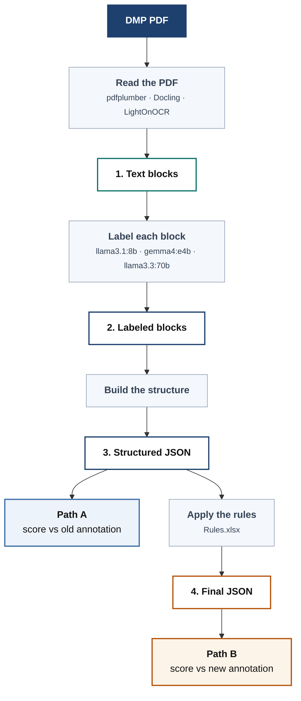

# DMPBridge

Turn Data Management Plan PDFs into structured, machine-readable records — using a local
LLM, with nothing leaving your machine.

A DMP is a document researchers write to describe what data a project will produce and how
it will be stored and shared. They arrive as PDFs, which makes them hard to search or
compare at scale. DMPBridge reads one, works out what each piece of text *is* — a section
heading, a question, an answer — and outputs structured JSON.

> **This is an active research project — things change often.** 
---

## How it works



Each numbered box is written to disk, so any stage can be inspected on its own.
More detail in **[docs/pipeline.md](docs/pipeline.md)**.

Every block gets one of five labels:

| Label | Meaning |
|---|---|
| `title` | Document title |
| `section.title` | Section heading |
| `section.description` | Instructions written by the funder |
| `question.text` | A question or prompt |
| `answer.text` | The researcher's response |

---

## Where the project stands

Research code — results are provisional and the evaluation set is small.

**Scored on 10 hand-annotated documents**, three models, pdfplumber:

| Model | Path A F1 | Path B F1 | Time for 10 documents |
|---|---|---|---|
| llama3.1:8b | 28.7% | 31.3% | 74 s |
| **gemma4:e4b** | **65.6%** | **66.5%** | **74 s** |
| llama3.3:70b | 71.7% | 72.1% | 22 min |

**gemma4:e4b is the practical choice** — within 6 points of the 70B at a fraction of the
runtime. (Path A scores the model's raw output against the original annotation; Path B
scores it after `Rules.xlsx` fills in blank questions, against the revised annotation —
see [Scoring](#scoring).)

Two caveats worth knowing before relying on these numbers:

- **Run-to-run noise is ±0.002 F1**, measured by running one configuration three times
  and comparing every count — not the ~3-point figure an earlier version of this file
  assumed but never measured. Differences smaller than ~0.005 are not meaningful; the
  gaps above are.
- **5 of 9 planned configurations are done** — all three models on pdfplumber, plus
  llama3.1:8b and gemma4:e4b on Docling (below). llama3.3:70b on Docling and all three
  on LightOnOCR are still outstanding.

**Docling, tried three separate ways this project has documented**, currently scores
*above* pdfplumber for both models tested:

| Model | Path A F1 | Path B F1 |
|---|---|---|
| llama3.1:8b | 60.0% | 62.7% |
| gemma4:e4b | 68.9% | 70.1% |

Provisional — see [Choosing an extractor](#choosing-an-extractor) for the trade-off this
result comes with.

---

## Quick start

**Requirements:** Python 3.10+ · [Ollama](https://ollama.com) running locally

```bash
python -m venv venv
venv\Scripts\Activate.ps1        # Windows
# source venv/bin/activate       # macOS / Linux

pip install -e .
ollama pull gemma4:e4b           # ~3 GB — recommended
```

Label one PDF:

```python
import dmpbridge

blocks = dmpbridge.process_pdf(
    "document.pdf",
    model="gemma4:e4b",
    extractor="pdfplumber",
    structured_output="structured.json",
)
```

Or the whole sample set:

```bash
dmpbridge-wholedoc --model gemma4:e4b --extractor pdfplumber --start 1 --end 10
```

Re-runs skip samples that already have output.

**Or the smallest possible example** — edit [`demo/config.yaml`](demo/config.yaml) (just
a model, extractor, and sample range) and run:

```bash
python scripts/run_demo.py
```

which writes each stage's result into `demo/output/{labeled,structured,final}/`. The same
config also drives [`notebooks/10-demo-from-yaml.ipynb`](notebooks/10-demo-from-yaml.ipynb),
which shows the YAML as input and the final document as output side by side.

---

## Choosing an extractor

| Extractor | Install | Best for |
|---|---|---|
| `pdfplumber` | included | Most PDFs — real bounding boxes and font data |
| `docling` | `pip install -e ".[docling]"` | Complex layouts, OCR-capable |
| `lighton` | `pip install -e ".[lighton]"` | Scanned / image-based PDFs (OCR) |

`pdfplumber` reads a PDF line by line, so a wrapped paragraph arrives as several blocks —
roughly 74 per document, each with a real position and font size.

`docling` reads the whole document, then splits it at each section heading — one heading
block plus **one block for everything under it**, roughly 2–29 per document depending on
how many headings the source has. That's deliberately coarser than pdfplumber: if a
section contains both a question and its answer, they land in the same block and can only
get one label. In exchange it currently scores higher (see above) — the trade-off is real
and unresolved, not a strict improvement. No bounding boxes or font data; OCR runs only on
pages without a usable text layer (none of the 10 sample PDFs need it, so OCR itself is
untested here). A `.md` file with the raw Docling export is saved alongside the cached
block JSON in `data/output/1_extracted/docling/` for inspection.

---

## Where the output goes

```
data/output/
├── 1_extracted/<extractor>/sampleN.json     text blocks, no labels
├── 2_labeled/<tag>/sampleN.json             the same blocks, labeled
├── 3_structured/<tag>/sampleN.json          nested into the DMP Tool schema
└── 4_final/<tag>/sampleN.json               annotation rules applied
```

`<tag>` is `<model>_<extractor>_whole_doc`. Filenames are the same at every stage, so you
can open `sampleN.json` in each folder and follow one document through.

**Stage 1 is keyed by extractor, not by model**, and is cached — reading a PDF doesn't
depend on which LLM labels it. Labeling with three models costs one read, not three:

```bash
dmpbridge-wholedoc --model llama3.1:8b --extractor lighton   # reads and caches
dmpbridge-wholedoc --model gemma4:e4b  --extractor lighton   # reuses the cache

dmpbridge-wholedoc --model gemma4:e4b --extractor lighton --no-cache   # force re-read
dmpbridge-wholedoc --model gemma4:e4b --extractor lighton --no-rules   # skip stage 4
```

To read PDFs with no LLM involved at all:

```bash
python scripts/extract_pdfplumber.py
```

---

## Scoring

Output is compared against hand-annotated reference documents. The annotation standard
changed partway through the project, so everything is scored twice:

- **Path A** — the structured output against the original annotation
- **Path B** — after filling blank questions using `data/input/Rules.xlsx`, against the newer one

Both use the same scoring: a predicted item matches a reference item when enough of its
words are contained in it (**100% by default** — every word, no partial credit; pass
`threshold=0.75` to relax it), then precision, recall and F1 as usual.

```bash
dmpbridge-evaluate      gemma4-e4b_pdfplumber_whole_doc    # Path A
dmpbridge-evaluate-new  gemma4-e4b_pdfplumber_whole_doc    # Path B
```

Both paths are also driven from one YAML file, which is what the numbers table above is
built from:

```bash
dmpbridge-experiment experiments/llama3.1-8b-wholedoc.yaml --evaluate
```

A new annotation source ("Path C") doesn't need new code — it's a new entry in an
`evaluation:` list in the YAML (`experiments/full-example.yaml` shows every field). See
`EvaluationPath` in `dmpbridge/evaluation/evaluate.py`.

---

## Tests

```bash
pip install -e ".[dev]"
pytest tests/
```

---

## Running on multiple GPUs

Ollama may pick the Vulkan backend over CUDA, which is unstable across several cards and
ignores `CUDA_VISIBLE_DEVICES`. **`gemma4:e4b`** — the recommended model above — also
crashes on load under recent Ollama versions unless one more flag is set, since it's
multimodal and the crash is in fitting its vision projector, not a GPU problem. Start the
server with all of these, killing any running instance first (env vars only apply to a
freshly started process):

```bash
CUDA_VISIBLE_DEVICES=0,1,2,3 OLLAMA_VULKAN=0 OLLAMA_SCHED_SPREAD=0 \
OLLAMA_KEEP_ALIVE=-1 LLAMA_ARG_FIT=off ollama serve
```

Then check `ollama ps` reports **100% GPU**. Anything less means part of the model spilled
to CPU, and a large model will take hours instead of minutes. Full context on why each
flag exists is in `CLAUDE.md`.
