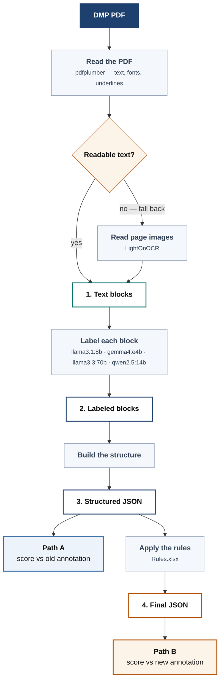

# DMPBridge

[](https://github.com/fairdataihub/dmpbridge/graphs/contributors)
[](https://github.com/fairdataihub/dmpbridge/stargazers)
[](https://github.com/fairdataihub/dmpbridge/issues)
[](LICENSE)
[](#how-to-cite)


A Data Management Plan (DMP) describes how researchers will manage, preserve, and share
project data in line with the Findable, Accessible, Interoperable, and Reusable (FAIR)
principles and other relevant disciplinary guidelines. DMPs are commonly required by funders
with every grant proposal, but the formats and requirements imposed by each funder keep
evolving, and no two funders' PDFs are structured the same way.

DMPBridge is an open-source (MIT License), Python-based pipeline that converts DMP PDFs from
any funder format into DMP Tool JSON, combining a narrative portion that mirrors DMP Tool's
internal structure with the RDA DMP Common Standard JSON for machine-actionable output.

This project is part of a broader extension of the DMP Tool platform. The ultimate goal is
to integrate the DMP Chef pipeline into the [DMP Tool](https://dmptool.org/), providing
researchers with a familiar and convenient user interface that does not require any coding
knowledge.

👉 Learn more: **[DMP Bridge](https://fairdataihub.org/dmp-bridge)**

> **This is an active research project, things change often.**

---
## Standards followed
The overall codebase is organized in alignment with the **[FAIR-BioRS guidelines](https://fair-biors.org/)**. All Python code follows **[PEP 8](https://peps.python.org/pep-0008/)** conventions, including consistent formatting, inline comments, and docstrings.Project dependencies are fully captured in that same
**[pyproject.toml](https://github.com/fairdataihub/dmpbridge/blob/main/pyproject.toml)**.

---

## How it works



The model's one job is to decide what each piece of text *is*. Every block gets one of five
labels, and the structure is built from those:

| Label | Meaning |
|---|---|
| `title` | Document title |
| `section.title` | Section heading |
| `section.description` | Instructions written by the funder |
| `question.text` | A question or prompt |
| `answer.text` | The researcher's response |

---

## Quick start

Three commands' worth of setup, then one command to run it. You need
[Python 3.10+](https://www.python.org/downloads/) and [Ollama](https://ollama.com). 
```bash
# 1 — get the code and install it
git clone https://github.com/fairdataihub/dmpbridge.git
cd dmpbridge
python -m venv venv
venv\Scripts\Activate.ps1          # macOS / Linux:  source venv/bin/activate
pip install -e .

# 2 — download a local model (~3 GB, one time)
ollama pull gemma4:e4b

# 3 — label your first document
dmpbridge-wholedoc --model gemma4:e4b --fallback auto --start 1 --end 1
```

That takes about 20 seconds and writes your result to:

```
data/output/4_final/gemma4-e4b_pdfplumber_whole_doc/sample1.json
```

Change `--end 1` to `--end 13` to run the whole sample set. A document that needs the OCR
rescue below takes longer — around 40 seconds.

### What you get

The PDF goes in as flat text. What comes out is nested — sections, the questions inside
them, and the researcher's answer attached to each question:

```json
{
  "title": "DATA MANAGEMENT AND SHARING PLAN",
  "section": [
    {
      "title": "Element 1: Data Type:",
      "order": 1,
      "question": [
        {
          "text": "A. Types and amount of scientific data expected to be generated…",
          "answer": {
            "json": {
              "type": "textArea",
              "answer": "This secondary data analysis project will analyze deidentified…"
            }
          }
        }
      ]
    }
  ]
}
```

---

## Ways to run it

### Option A — Jupyter demo

See each stage happen, with the settings and the finished document side by side.

1. Open [`demo/config.yaml`](demo/config.yaml) and set the model:

   ```yaml
   model: gemma4:e4b
   sample_end: 1        # how many sample PDFs to run
   ```

2. Open [`notebooks/demo-from-yaml-config.ipynb`](notebooks/demo-from-yaml-config.ipynb)
   and click **Run All**. Nothing inside the notebook needs editing.

3. The last cell prints the finished document — title, sections, questions, answers.

No Jupyter? The same config runs from the terminal, writing each stage into `demo/output/`:

```bash
python scripts/run_demo.py
```

### Option B — one command

Convert a PDF and get the JSON. Nothing to configure.

1. Put your PDF anywhere you like.

2. Run:

   ```bash
   dmpbridge my-plan.pdf --model gemma4:e4b
   ```

3. Open **`my-plan_labeled_structured.json`**, written next to your PDF. That's the DMP Tool
   JSON. (`my-plan_labeled.json` is also written — the flat list of labeled blocks behind
   it.)

Scanned or image-only PDFs are OCR'd automatically, no flag needed. Every other flag, the
batch runner for the sample set, and the Python API are in
**[docs/configuration.md](docs/configuration.md)**.

---

## Where the output goes

```
data/output/
├── 1_extracted/<extractor>/sampleN.json     text blocks, no labels
├── 2_labeled/<tag>/sampleN.json             the same blocks, labeled
├── 3_structured/<tag>/sampleN.json          nested into the DMP Tool schema
└── 4_final/<tag>/sampleN.json               annotation rules applied
```

`<tag>` is `<model>_<extractor>_whole_doc`. Filenames are the same at every stage, so you
can follow one document all the way through.

---

## License
This work is licensed under the **[MIT License](https://opensource.org/license/mit/)**. See **[LICENSE](https://github.com/fairdataihub/dmpbridge/blob/main/LICENSE)** for more information.


---

## Feedback and contribution
Use **[GitHub Issues](https://github.com/fairdataihub/dmpbridge/issues)** to submit feedback, report problems, or suggest improvements.  
You can also **fork** the repository and submit a **Pull Request** with your changes.

---

## How to cite
If you use this code, please cite this repository using the **versioned DOI on Zenodo** for the specific release you used (instructions will be added once the Zenodo record is available). For now, you can reference the repository here: **[fairdataihub/dmpchef](https://github.com/fairdataihub/dmpbridge)**.
