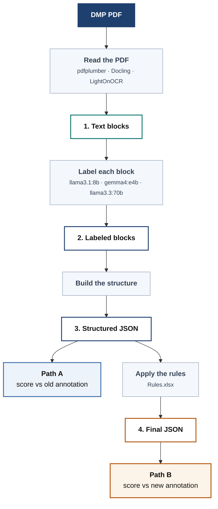

# DMPBridge

Turn Data Management Plan PDFs into structured, machine-readable records — using a local
LLM, with nothing leaving your machine.

A DMP is a document researchers write to describe what data a project will produce and how
it will be stored and shared. They arrive as PDFs, which makes them hard to search or
compare at scale. DMPBridge reads one, works out what each piece of text *is* — a section
heading, a question, an answer — and outputs structured JSON.

---

## How it works



Each numbered box is written to disk, so any stage can be inspected on its own.
More detail in **[docs/pipeline.md](docs/pipeline.md)**.

Every block gets one of five labels:

| Label | Meaning |
|---|---|
| `title` | Document title |
| `section.title` | Section heading |
| `section.description` | Instructions written by the funder |
| `question.text` | A question or prompt |
| `answer.text` | The researcher's response |

---

## Where the project stands

Research code — results are provisional and the evaluation set is small.

**Scored on 10 hand-annotated documents**, three models, all using pdfplumber:

| Model | F1 | Time for 10 documents |
|---|---|---|
| llama3.1:8b | 61.9% | 74 s |
| **gemma4:e4b** | **74.3%** | **74 s** |
| llama3.3:70b | 76.0% | 22 min |

**gemma4:e4b is the practical choice** — within 2 points of the 70B at a fraction of the
runtime.

Two caveats worth knowing before relying on these numbers:

- Repeating an identical run moves the score by roughly **3 points**, so gemma4:e4b and
  llama3.3:70b cannot currently be told apart. Measuring that variation properly is the
  next job.
- **3 of 9 planned configurations are done.** Docling and LightOnOCR have not been run
  since the last prompt change.

---

## Quick start

**Requirements:** Python 3.10+ · [Ollama](https://ollama.com) running locally

```bash
python -m venv venv
venv\Scripts\Activate.ps1        # Windows
# source venv/bin/activate       # macOS / Linux

pip install -e .
ollama pull gemma4:e4b           # ~3 GB — recommended
```

Label one PDF:

```python
import dmpbridge

blocks = dmpbridge.process_pdf(
    "document.pdf",
    model="gemma4:e4b",
    extractor="pdfplumber",
    structured_output="structured.json",
)
```

Or the whole sample set:

```bash
dmpbridge-wholedoc --model gemma4:e4b --extractor pdfplumber --start 1 --end 10
```

Re-runs skip samples that already have output.

---

## Choosing an extractor

| Extractor | Install | Best for |
|---|---|---|
| `pdfplumber` | included | Most PDFs |
| `docling` | `pip install -e ".[docling]"` | Complex layouts |
| `lighton` | `pip install -e ".[lighton]"` | Scanned / image-based PDFs (OCR) |

`pdfplumber` reads a PDF line by line, so a wrapped paragraph arrives as several blocks.
Those are merged back into paragraphs before labeling — roughly 25 blocks per document
instead of 74. To get the raw line-level blocks:

```python
from dmpbridge.extractors import get_extractor
get_extractor("pdfplumber", merge_lines=False)
```

---

## Where the output goes

```
data/output/
├── 1_extracted/<extractor>/sampleN.json     text blocks, no labels
├── 2_labeled/<tag>/sampleN.json             the same blocks, labeled
├── 3_structured/<tag>/sampleN.json          nested into the DMP Tool schema
└── 4_final/<tag>/sampleN.json               annotation rules applied
```

`<tag>` is `<model>_<extractor>_whole_doc`. Filenames are the same at every stage, so you
can open `sampleN.json` in each folder and follow one document through.

**Stage 1 is keyed by extractor, not by model**, and is cached — reading a PDF doesn't
depend on which LLM labels it. Labeling with three models costs one read, not three:

```bash
dmpbridge-wholedoc --model llama3.1:8b --extractor lighton   # reads and caches
dmpbridge-wholedoc --model gemma4:e4b  --extractor lighton   # reuses the cache

dmpbridge-wholedoc --model gemma4:e4b --extractor lighton --no-cache   # force re-read
dmpbridge-wholedoc --model gemma4:e4b --extractor lighton --no-rules   # skip stage 4
```

To read PDFs with no LLM involved at all:

```bash
python scripts/extract_pdfplumber.py --both     # merged and raw, with a comparison
```

---

## Scoring

Output is compared against hand-annotated reference documents. The annotation standard
changed partway through the project, so everything is scored twice:

- **Path A** — the structured output against the original annotation
- **Path B** — after filling blank questions using `data/input/Rules.xlsx`, against the newer one

Both use the same scoring: match on shared words, then precision, recall and F1.

```bash
dmpbridge-evaluate      gemma4-e4b_pdfplumber_whole_doc    # Path A
dmpbridge-evaluate-new  gemma4-e4b_pdfplumber_whole_doc    # Path B
```

---

## Notebooks

| Notebook | What it shows |
|---|---|
| `1-llama31-8b-results-pdfplumber.ipynb` | Results for llama3.1:8b, and a walkthrough of how the score is worked out |
| `2-gemma4-e4b-results-pdfplumber.ipynb` | Results for gemma4:e4b |
| `3-llama33-70b-results-pdfplumber.ipynb` | Results for llama3.3:70b |
| `annotation_conversion_test.ipynb` | How the annotation rules fill blank questions, and whether they are right |

All four follow the same layout, so you can open two side by side and compare.

---

## Documentation

| | |
|---|---|
| [docs/pipeline.md](docs/pipeline.md) | The pipeline in more detail |
| [docs/DIAGRAMS.md](docs/DIAGRAMS.md) | How to edit the diagrams |
| `Report-doc/project_report.docx` | Full technical report |
| `Report-doc/worklog/` | Daily notes — what changed, what was measured, what did not work |

---

## Tests

```bash
pip install -e ".[dev]"
pytest tests/
```

---

## Running on multiple GPUs

Ollama may pick the Vulkan backend over CUDA, which is unstable across several cards and
ignores `CUDA_VISIBLE_DEVICES`. Start the server like this:

```bash
CUDA_VISIBLE_DEVICES=0,1,2,3 OLLAMA_VULKAN=0 OLLAMA_SCHED_SPREAD=0 ollama serve
```

Then check `ollama ps` reports **100% GPU**. Anything less means part of the model spilled
to CPU, and a large model will take hours instead of minutes.
