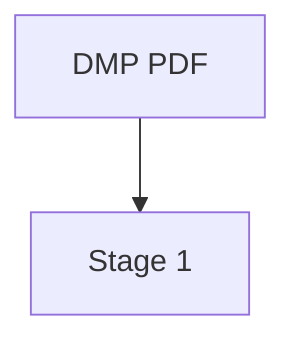
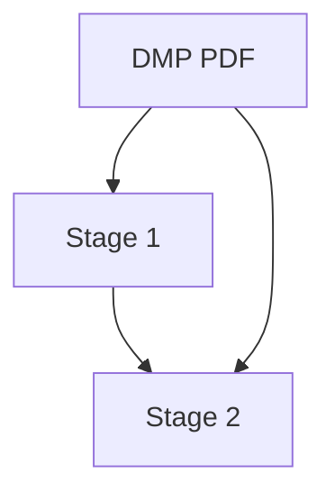
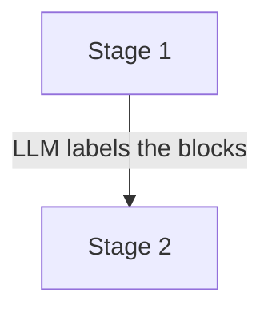
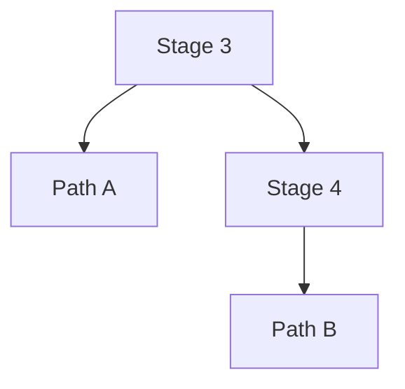
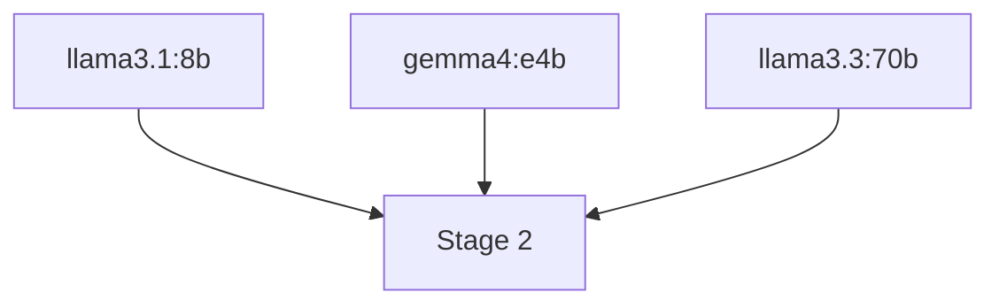
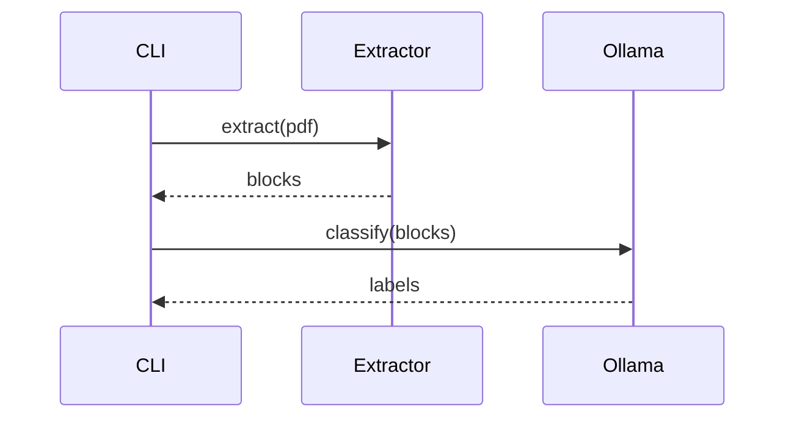

# Editing the diagrams

The project diagram in [pipeline.md](pipeline.md) is written in **Mermaid** — a small text
language for diagrams. You edit text; the picture is drawn for you.

Why text and not a drawing tool:

- **GitHub draws it automatically.** Nothing to install, nothing to upload.
- **Git can diff it.** Changing a box shows up as a one-line change. A PNG shows up as
  "binary file differs", which tells you nothing.
- **No layout work.** Mermaid positions the boxes. You describe what connects to what.

---

## 1. Seeing it

**On GitHub** — open `docs/pipeline.md`. The diagram renders automatically. Nothing to set up.

**In VS Code** — install the extension **Markdown Preview Mermaid Support**:

1. `Ctrl+Shift+X` to open Extensions
2. Search `Markdown Preview Mermaid Support`
3. Install
4. Open `docs/pipeline.md` and press `Ctrl+Shift+V` to preview

The preview updates as you type, so you can edit and watch.

**In a browser, for quick experiments** — <https://mermaid.live> renders as you type. Paste
in the block from `pipeline.md`, try a change, paste it back when happy.

---

## 2. The basics

Every diagram sits in a fenced block:

````markdown

````

`flowchart TD` means *top-down*. Use `LR` for left-to-right.

`A --> B` means "draw a box A, a box B, and an arrow from A to B."

### Giving a box a label



`PDF` is the **name** — short, used to refer to the box.
`"DMP PDF"` is the **label** — what actually appears on screen.

Once a box is named you can refer to it by name alone:



### Labelling an arrow

Put text between pipes:



### Branching

Several arrows out of one box:



Several arrows into one box:



---

## 3. Formatting inside a box

The label is HTML, so:

| You want | Write |
|---|---|
| a line break | `<br/>` |
| bold | `<b>text</b>` |
| italic | `<i>text</i>` |
| code / file path | `<code>path.json</code>` |
| smaller text | `<small>note</small>` |

Combined, which is what `pipeline.md` does:

```
S1["<b>STAGE 1 — extracted blocks</b><br/>
    <code>1_extracted/&lt;extractor&gt;/sampleN.json</code><br/>
    <i>cached per extractor</i>"]
```

> **Watch out for `<` and `>`.** Mermaid reads them as HTML. To show them literally, write
> `&lt;` and `&gt;` — which is why the path above says `&lt;extractor&gt;` and not
> `<extractor>`.

---

## 4. Colour

Define a style once, then apply it to boxes:

```
classDef stage fill:#ffffff,stroke:#1E406E,stroke-width:2px,color:#111

class S1,S2,S3 stage
```

- `classDef <name> ...` — create a style
- `class <boxes> <name>` — apply it, comma-separated, no spaces

The styles used in `pipeline.md`:

| Style | Meaning | Colour |
|---|---|---|
| `input` | the PDF going in | solid navy |
| `extr` | the three extractors | blue outline |
| `cached` | stage 1 — cached, shared across models | teal outline |
| `stage` | stages 2 and 3 | navy outline |
| `rules` | stage 4 — where `Rules.xlsx` applies | amber outline |
| `pathA` / `pathB` | the two evaluation paths | tinted fill |

The colours are meaningful, not decorative: teal marks the one stage that is shared between
models, amber marks everything the annotation rules touch.

---

## 5. Worked example — adding a box

Say you add a second extractor. `pipeline.md`'s current diagram names the extractor inside
the "Read the PDF" node's own label rather than as a separate box per extractor — find:

```
    PDF --> READ["<b>Read the PDF</b><br/><small>pdfplumber</small>"]
```

and extend the `<small>` list:

```
    PDF --> READ["<b>Read the PDF</b><br/><small>pdfplumber · MyExtractor</small>"]
```

One edit for a name-only addition. If the new extractor's behavior is different enough to
be worth its own box (the way LightOnOCR briefly was, before it — and the id-based
classification path it needed — were removed), split `READ` back into one node per
extractor, each with its own arrow into stage 1, and style them together with a shared
mermaid `class`.

---

## 6. Checking your work

Structure can be checked without rendering:

```bash
python scripts/check_mermaid.py docs/pipeline.md
```

It catches the mistakes that are easy to make and hard to spot:

- an arrow pointing at a box that was never defined (usually a typo in a name)
- a `class` line referring to a box that doesn't exist
- a `class` using a style that was never defined with `classDef`

It does **not** check that the result looks good — for that, preview it.

---

## 7. The Word report

The report at `Report-doc/project_report.docx` needs a real image, and Mermaid cannot
produce one without Node.js installed. So that diagram is drawn separately with matplotlib.

Both diagrams show the same pipeline. **If you change one, change the other**, or they will
drift apart:

| | Source | Rebuild with |
|---|---|---|
| GitHub / markdown | `docs/pipeline.md` | nothing — GitHub draws it |
| Word report | matplotlib script | re-run the report build |

If you would rather maintain only one, installing [Node.js](https://nodejs.org) lets
`mermaid-cli` export a PNG:

```bash
npm install -g @mermaid-js/mermaid-cli
mmdc -i docs/pipeline.md -o Report-doc/pipeline_diagram.png -w 1600
```

Then the matplotlib script can be deleted and Mermaid becomes the single source. Worth doing
only if you expect to keep changing the diagram.

---

## Other diagram types

Mermaid isn't only flowcharts. The two most likely to be useful here:

**Sequence** — who calls what, in order:

````markdown

````

**Timeline / Gantt** — for planning:

````markdown
```mermaid
gantt
    title Experiment sweep
    dateFormat YYYY-MM-DD
    llama3.1:8b runs  :done,    p1, 2026-08-06, 1d
    gemma4:e4b runs   :active,  p2, after p1, 1d
```
````

Full reference: <https://mermaid.js.org/intro/>
