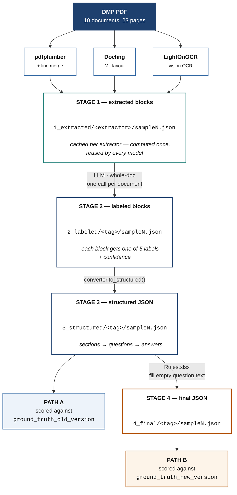

# Pipeline

**Two things the diagram is meant to make obvious:**

- **Stage 1 is cached and keyed by extractor**, not by model. Extraction doesn't depend on
  which LLM labels the blocks, so labeling with three models costs one extraction rather
  than three.
- **The paths diverge at stage 3.** Path A scores the structured output against the original
  annotation; Path B scores stage 4, after the `Rules.xlsx` conversion, against the newer
  one. Both stages are always written, so the two forms can be compared directly.

Both paths use the same scoring engine — greedy match by token containment ≥ 0.75, then
micro-averaged precision / recall / F1. Nothing differs but the reference data.
