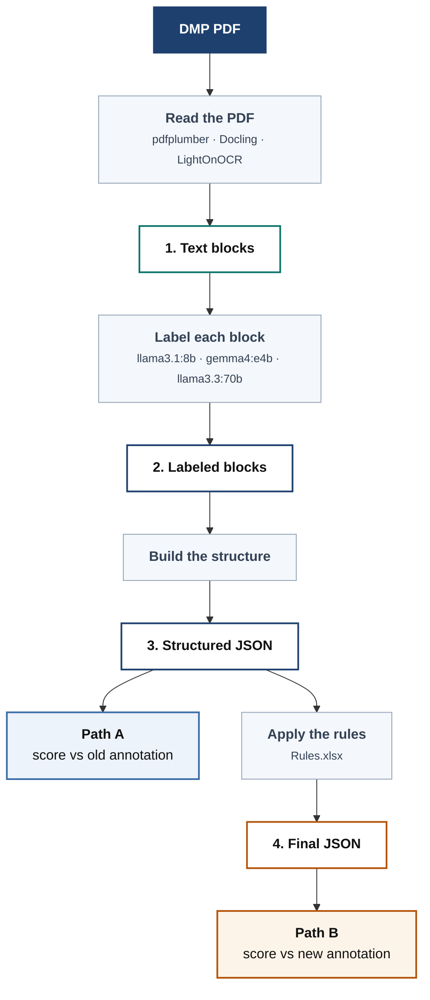

# Pipeline



The numbered boxes are the four things written to disk. The grey boxes between them are the
steps that produce each one.

**Two things worth noticing:**

- **Step 1 is shared.** Reading the PDF doesn't depend on which model does the labeling, so
  it is done once and reused. Labeling with three models costs one read, not three.
- **The two scores branch at step 3.** Path A scores the structure as the model produced it.
  Path B first fills in blank questions using the rules, then scores that. Both are kept, so
  you can compare them.

---

## Detail

| Step | What it does | Choices |
|---|---|---|
| Read the PDF | turn the page into text blocks | `pdfplumber`, `Docling`, `LightOnOCR` |
| Label each block | one LLM call per document | `llama3.1:8b`, `gemma4:e4b`, `llama3.3:70b` |
| Build the structure | nest into sections → questions → answers | — |
| Apply the rules | fill blank questions | `data/input/Rules.xlsx` |

Where each stage is written:

```
data/output/
├── 1_extracted/<extractor>/sampleN.json     keyed by extractor — shared across models
├── 2_labeled/<tag>/sampleN.json
├── 3_structured/<tag>/sampleN.json          <- Path A scores this
└── 4_final/<tag>/sampleN.json               <- Path B scores this
```

`<tag>` is `<model>_<extractor>_whole_doc`. Filenames are the same at every stage, so you
can open `sampleN.json` in each folder and follow one document through.

Both paths use the same scoring — match on shared words, then precision / recall / F1.
Nothing differs but which annotation they compare against.
